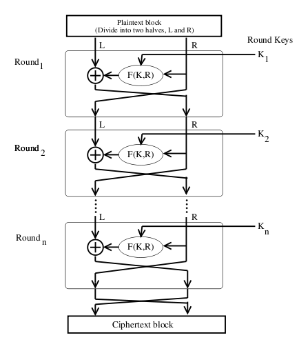

# Primitieven

Primitieven zijn de wiskundige bouwstenen van cryptografische protocollen die gebruikt worden om systemen te beveiligen. Deze componenten worden gebruikt om hashes, encryptie en digitale handtekeningen mogelijk te maken. Zonder primitieven is het onmogelijk om de CIA tirade te bewerkstelligen.

## Randomness of 'willekeur'

- Oorsprong en doel van cryptografie
- Ontbreken van herkenbare patronen
- Eenheid van willekeur: entropie

> Anyone who considers arithmetical methods of producing random digits is, of course, in a state of sin. - John von Neumann

> The generation of random numbers is too important to be left to chance. - Robert R. Coveyou

Cryptografie begint én eindigt met willekeur. Het begint met willekeur in de betekenis dat willekeur in ieder cryptografisch algoritme een rol speelt. Het eindigt met willekeur in de betekenis dat een versleuteld bericht zo dicht mogelijk in de buurt moet komen van willekeur, ofwel dat er in een versleuteld bericht géén herkenbare patronen meer voor mogen komen. Hoe dichter een reeks getallen in de buurt van willekeur komt, hoe hoger de entropie.

Om dit met een computerprogramma te doen is onmogelijk, vandaar de quote van John von Neumann. Een computer is een wiskundige, deterministische machine die op dezelfde vraag altijd hetzelfde antwoord moet geven, dus kunnen we een computerprogramma hooguit een “schijnbaar willekeurige” of “pseudorandom” reeks maken. Meestal is dat goed genoeg.  
De quote van Coveyou geeft aan dat kans alleen niet voldoende zekerheid geeft dat er inderdaad geen patronen in een reeks bestaan. Dus hoe creeren we voldoende, bruikbare, willekeurige reeksen?

## Entropie

> In computing, entropy is the **randomness** collected by an operating system or application for use in cryptography or other uses that require random data.

2 getallen van 9 cijfers:

**Getal 1**: 127777216  
**Getal 2**: 862491735

Welk getal heeft **meer entropie**?

### Antwoord

De meeste mensen zullen naar string 2 kijken. Wel, de grap is dat string 1 méér entropie bevat dat string 2, hoewel string 2 er “meer willekeurig” uit ziet.  
Beiden bestaan uit 9 posities die in string 1 volledig willekeurig gevuld zijn. Het cijfer 7 is oververtegenwoordigd maar er is een redelijke kans dat zoiets gebeurt. De kans dat een willekeurige reeks cijfers alle getallen van 0 tot 9 bevat ZONDER herhalingen, zoals in string 2, is vele malen kleiner!

## Cryptographically Secure Pseudorandom Number Generators (of CSPRNG's)

- Computerfunties om lange reeksen cijfers met hoge mate van willekeur te genereren
- Geintegreerd in ieder OS (/dev/urandom, Win32 CryptGenRandom)
- Interface met hardware vult entropy pool: CPU-klokken, stroomvoorziening, antennes...
- Hash- of cryptofunctie ("cipher") maakt uit pool langere random strings

> Omdat willekeur zó belangrijk is voor veilig computergebruik wordt met ieder OS wel een CSPRNG meegeleverd. Unix heeft /dev/random of /dev/urandom, windows heeft de functie CryptGenRandom in de W32.CryptoApi zitten. Maar, met John von Neumann’s uitspraak van een paar slides geleden in het achterhoofd (“State of Sin”) dienen we wél een bron van absolute willekeur te gebruiken om herhaalbaarheid uit te sluiten. Daarom maakt iedere CSPRNG gebruik van één of meerdere hardwareinterfaces waarmee een hogere mate van entropie bewerkstelligd kan worden. Vaak wordt **het tik-verschil tussen twee hardwareklokken** (cpu en memory) gebruikt als input. Sommige meer specialistische systemen (SafeNet) gebruiken **fluctuaties in het stroomniveau of een antenne waarmee kosmische straling gemeten kan worden**. Sommige experimentele systemen gebruiken een Geiger-Muller buis en een kleine hoeveelheid radioactief materiaal om input te verzamelen. Deze entropie wordt door een encryptie of hash-functie gehaald (komt later nog terug!) en dat resulteert in (pseudo-)willekeurige reeksen.

## Cryptofunctie

- Encryptie en cryptografie
- Kruptos + Grafein
- Betekent letterlijk "Geheim schrijven"
- **Plaintext** middels een **cryptofunctie** en een **secret** omzetten naar **ciphertext**
- Is **omkeerbaar** (**ENcryption** en **DEcryption**)

> “Cryptofunctie” is een afkorting voor “cryptografische functie”. Cryptografie is de “kunst van het schrijven in het geniep” ofwel geheimschrift. Een cryptofunctie is derhalve een wiskundige functie die geheimschrift mogelijk maakt. En zo komen we dus bij encryptie terecht
>
> We hanteren de volgende definities wanneer we het over cryptografie hebben: plaintext (het te versleutelen bericht/bestand) “functie” (het cryptografische mechanisme waarmee versleuteld wordt), “secret” (de sleutel voor het ver- of ontcijferen van een bericht) en de ciphertext (het versleutelde bericht).
>
> Dit lijkt voor de hand liggend, maar dat is het niet: encryptie is ALTIJD OMKEERBAAR. Dit omkeren of ongedaan maken van encryptie noemen we decryptie.

## Typen encryptie

Worden bepaald door:

- Opteratietypen in functie:
  - Substitutie
  - Transformatie
- Aantal sleutels
  - Eén - Symmetrisch
  - Twee - Asymmetrisch
- Operatiemodus
  - Block
  - Stream

**Substitutie**
het verplaatsen van tekens volgens een patroon

**Transformatie**
het veranderen van tekens volgens een patroon

**Symmetrische encryptie**
gebruikt dezelfde keys voor en- en decryptie

**Asymmetrisch encryptie**
gebruikt verschillende doch wiskundig aan elkaar verbonden keys voor en- en decryptie.

**Block ciphers**
encryptiefunctie waarbij de plaintext in blokken van een vaste lengte versleuteld wordt.

**Stream ciphers**
encryptiefunctie waarbij de plaintext in een doorlopende stroom versleuteld wordt.

## Substitutie vs Transformatie

**Substitutie: De griekse "Scytale"**
De Scytale werd door de oude Grieken gebruikt om berichten te versleutelen. Door ontvanger en verzender van dezelfde stok te voorzien konden op een veilige manier berichten worden overgedragen.

**Transformatie: Enigma**
De Enigma was een Duits systeem wat in WO2 gebruikt werd om de communicatie tussen onderzeeërs en het thuisfront te beveiligen. Dit elektromechanische systeem kon alleen gekraakt worden door de inzet van enorme hoeveelheden mankracht.

Substitutiefuncties zijn goeddeels in onbruik geraakt - de plaintext is namelijk aanwezig binnen de ciphertext en dit maakte de code makkelijk te kraken. Zeker voor gebruik met computers zijn transpositiefuncties tegenwoordig standaard. We zullen substitutieciphers verder buiten beschouwing laten.

## Symmetrische en asymmetrische encryptie

### Symmetrische encryptie

- 1 sleutel voor beide partijen - symmetrisch
- Makkelijk maar link: hoe hou je de sleutel veilig?

Het probleem met symcrypt is dat de sleutel uitgewisseld en op twee plaatsen beheerd moet worden. Dit brengt risicos met zich mee.

### Asymmetrische encryptie

- 2 sleutels, 1 voor ver- en 1 voor ontsleutelen.
- Lastiger maar veiliger

Asymcrypt heeft als nadelen dat het beheren van een aparte sleutel voor ont- en vercijferen lastiger is, dat de sleutels groter moeten zijn om veiligheid te waarborgen en dat het veel tijd kost om een sleutelpaar te maken.

## Block- en Stream ciphers

### Block

- Vooral toepasbaar voor bulk-encryptie
- Versleuteling in 'brokken' van gelijk formaat
- Ieder blok dient als input voor het volgende blok
- Voorbeelden: **AES en DES**

### Stream

- Vooral toepasbaar voor encryptie in een sessie
- Versleuteling in continue stroom
- Sleutel maakt (pseudo)random data die wordt gecombineerd met de plaintext
- Voorbeelden: **RC4, ChaCha**

**Block-ciphers** zijn in sommige opzichten lastig omdat ze een **vast formaat data** vereisen (wat wordt gerealiseerd met **“padding”**). Ieder blok wordt **afzonderlijk gecrypt**. Als daarbij iedere keer dezelfde sleutel wordt gebruikt zou dat een kwetsbaarheid veroorzaken. Daaorm wordt **een deel van de versleutelde info** gebruikt om de sleutel aan te passen **voordat** het tweede blok versleuteld wordt. Zo wordt dezelfde sleutel **nóóit** meermaals gebruikt binnen 1 sessie.
**AES** is waarschijnlijk het **meest gebruikte symcrypt cipher**. **DES** was de **standaard** (opgelegd door de VS) maar is nu hopeloos verouderd.  
**Stream-ciphers** zijn lastig in het gebruik, omdat je een **continu** proces van **encryptie** en **decryptie** toe moet passen – dit **VREET** randomness/entropie.
**Block Ciphers** genereren hun eigen entropie door telkens een nieuwe sleutel te leveren.
**Stream Ciphers** werden vroeger veel gebruikt, maar sinds vrijwel alle datacom overgegaan is op **IP-basis** raken ze in onbruik. Veel block-ciphers kunnen zelfs in **stream-modus** toegepast worden, wat stream ciphers nog zeldzamer maakt.

**IP-verkeer** is natuurlijk al in blokken verdeeld – een **TCP-datagram** kan gemakkelijk door een block-cipher gecrypt worden. Daarmee is de bestaansreden van stream-ciphers ernstig **verkleind**.

## Stream ciphers: XOR op twee data-stromen

Sleutel werkt als input voor een algoritme dat resulteert in een pseudo-random stroom die door een XOR-operatie met de plaintext wordt gecombineerd. Er vindt dus geen hergebruik van sleutelmateriaal plaats. Probleem is wel dat je hier heeeeeel veel entropie voor nodig hebt, iets wat niet altijd makkelijk te realiseren is.

## Blockciphers: Codebook en Chaining

---

Als je ieder nieuw block afzonderlijk crypt kan dat onveilig worden. Deze **“ECB”**-encryptie verbergt namelijk niet alle patronen! Dus, om veilig te zijn moeten we ervoor zorgen dat iedere encryptieslag wordt beinvloed door de ciphertext van het voorgaande block. Dit doen we met een **Block Chaining encryption** mechanisme. Hierbij dient de uitkomst van iedere encryptieronde (deels) als input voor de volgende ronde.  
Wanneer we het eerste block crypten hebben we natuurlijk geen voorgaande ciphertext om als input te gebruiken. Om deze juist te kunnen encrypten is een **“Initialization Vector”** of IV nodig. Deze kan random gekozen (een **“Nonce”** of **“Number Used Once”**) en met de ciphertext meegestuurd worden, of als standaard instelling gekozen worden.

## DES: Data Encryption Standard

- Oude standaard (1977)
- 56-bits sleutel
- Chained Block Cipher obv. Feistel diagram
- Later verbeterd door 3-dubbele uitvoering (Triple DES of 3DES)

**DES** is een (nu verouderd) **chain blockcipher**. DES is bedacht door de **NSA**, gebaseerd op IBM’s Lucifer-cipher maar dan met een **64-bits (waarvan 8 checksum)** in plaats van **128-bits sleutel** zodat de US Government makkelijker in kan breken als dat nodig bleek. Er is dus niet nieuws onder de horizon.
DES was slecht qua security, maar **makkelijk, snel en toegestaan door de US Government**. Daarom werd het dé standaard. Om de beveiliging te verbeteren werd later een 3-dubbele implementatie bedacht maar: “polish a turd, it’s still just a turd”.

---

We kiezen een sleutel **“K1”** en **“hakken”** dan de plaintext in twee stukken: **“R0”** en **“L0”**. De ene helft van de ciphertext **“R0”** wordt door een encryptiefunctie **“F”** versleuteld, waarna de resulterende ciphertext gebruikt wordt om de andere helft van de plaintext **“L0”** te XOR-en. De plaintext **“R0”** wordt als **“L1”** doorgegeven aan de volgende iteratie van het proces.

De vanuit **“L0”** ge-XOR’de ciphertext wordt in de volgende iteratie gebruikt als **“R1”**, terwijl de **R0-cipher** wordt verwijderd. **“R1”** en **“L1”** staan nu klaar voor een nieuwe iteratie van de encryptieslag.

De sleutel wijzigt volgens een **permutatietabel**. Dit is nodig omdat DES anders kwetsbaar zou zijn voor herhaalde-sleutel aanvallen (risico bij block-ciphers, weet je nog?). Deze tabel is opgenomen in de DES-standaard.

---

_Note: Lees de sheets voor uitleg over DES_
