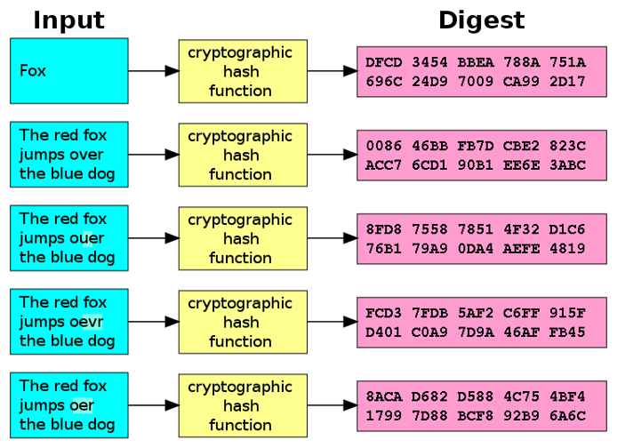

# Een kort overzicht

- Primitives
  - Randomness
  - Cryptografie
    - Symmetrische encryptie
      - Stream
      - Block
        - CBC
        - EBC
    - Asymmetrische encryptie

# Asymmetrie

Asymmetrie is de afwezigheid van symmetrie. In het geval van encryptie betekent dit dat er veschillende sleutels gebrukt worden voort het ver- en ontsleutelen van informatie

## Asymmetrische encryptie

Alice verstuurt Bob een bericht, wat ze versleutelt met haar vertrouwelijke sleutel of **private key**. Bob ontsleutelt dit met Alice's publieke sleutel of **public key**. De twee sleutels tezamen noemen we een sleutelpaar of **keypair**

## Hoe kan dat?

- Sleutels zijn aan elkaar gelinkt
- Relatie tussen sleutels is (waarschijnlijk) niet te kraken
- Gebaseerd op de aanname dat factorisatie een hard probleem is

De sleutels in een keypair zijn aan elkaar gelinkt, dat is duidelijk. Anders zou het onmogelijk zijn iets te encrypten met de een en te de-crypten met de ander.

Deze relatie is tot dusverre niet te kraken. We zeggen "waarschijnlijk" omdat het wiskundige bewijs hiervan nog niet geleverd is! Veiligheid op het internet is dus gebaseerd op een aanname.

Deze aanname bestaat eruit dat het **factoriseren** (ofwel het ontbinden in factoren) van het product van **twee priemgetallen** een “moeilijk” of “hard” probleem is – dat wil zeggen dat het met een normale computer niet in **polynomiale** tijd is op te lossen ofwel: dat er voor dit probleem geen snelle truuk bestaat. **Asymmetrische sleutels** bestaan namelijk uit twee priemgetallen die op twee verschillende manieren met elkaar gecombineerd worden. Als je erin slaagt om de factoren waaruit de **publieke sleutel** bestaat te berekenen kun je héél eenvoudig de **privesleutel** namaken, en vice-versa.

## Polynomiaal

Polynomiale tijd betekent “voor een computer sneller op te lossen dan door 1 voor 1 alle mogelijkheden af te gaan”. Een goede analogie is de opdracht om te controleren of een getal deelbaar is door 3. We gaan onszelf dus even als computer zien.

We kunnen dit getal met een staartdeling door drie delen en kijken of daar een natuurlijk getal uit komt, maar het kan makkelijker.

Voorbeeld: is het getal 9351683485524 deelbaar door 3?

**Stap 1**
Tel alle cijfers in het getal bij elkaar op
9+3+5+1+6+8+3+4+8+5+5+2+4 = 63

**Stap 2**
Herhaal dit totdat je 1 cijfer overhoudt
6+3 = 9

**Stap 3**
Is dit laatste getal deelbaar door 3?
Dan is het oorspronkelijke getal ook deelbaar door 3!

## Factorisatie

- Het uit elkaar slopen van een getal in factoren: 24 = 2 x 12, 3 x 8 en 4 x 6.
- Makkelijk in sommige gevallen, moeilijk in andere gevallen
- Het moeilijkste bij producten van priemgetallen

Zoals al eerder gezegd is **factorisatie** een probleem voor **asymmetrische encryptie**. Nu is factorisatie voor een computer meestal vrij makkelijk, tenzij het getal **a** heel groot is, en **b** uit het product van twee priemgetallen bestaat. Een priemgetal is een getal dat **alleen deelbaar is door zichtzelf en het getal 1** – een getal dat het product is van twee priemgetallen heeft dus maar nooit meer dan vier factoren – **die twee priemgetallen, zichzelf en het getal 1**.

MAAR DIT IS NIET WISKUNDIG BEWEZEN!

## Voorbeeld: RSA

- **R**ivest, **S**hamir en **A**dleman (1977)
- Werkten bij MIT
- Patent verkregen in **1983**
- Inmiddels ingehaald door andere standaarden maar nog steeds grotendeels veilig

Bij ISEC gebruiken we RSA om **asymcrypt** te illustreren. RSA is in 1977 bedacht door drie medewerkers van de MIT universiteit die iets te veel wijn hadden gedronken met Pesach. In 1983 is er een patent verstrekt en is RSA tot standaard verheven. Tegenwoordig zijn er andere, snellere en veiliger encryptieschemas als DSA, ECDSA en El Gamal, maar voor de meeste toepassingen is RSA nog steeds bruikbaar (de aanvallen zijn goeddeels theoretisch of hebben een beperkte impact).

### Onder de motorkap

- Neem 2 grote priemgetallen
- Vermenigvuldig deze met elkaar
- Bereken nu de indicator van dit product
- Kies een getal dat relatief priem is tov. deze indicator
- Bereken een getal waarmee geldt dat, indien vermenigvuldigd met het eerdere relatieve priemgetal, modulo de indicator de uitkomst 1 is.

**Indicator**: totiënt, of het aantal getallen dat geen deler gemeen heeft met dit getal.  
**Relatief priem**: twee getallen die geen deler gemeen hebben  
**Modulo**: de restwaarde bij deling

**Een voorbeeld**

- Kies 2 priemgetallen P (bv.61) en Q (bv. 53)
- P x Q = N  
  61 x 53 = 3233
  N = 3233
- I = KGV(P - 1, Q - 1)
  I = 780
- Kies een willekeurig getal E, relatief priem tov. I: 17
- Los op voor D: D x E mod I = 1
- D x 17 mod 780 = 1
- D = 413

De hoofdonderdelen van de keypair: N = 3233, E = 17, D = 413

> KGV = Kleinst Gemene Veelvoud (het kleinste getal dat een veelvoud is van beide factoren)
> https://www.beterrekenen.nl/website/index.php?pag=255
>
> 780 / (61-1) = 13 en 780 / (53-1) = 15
>
> Relatief priem: er bestaat geen getal waardoor beide factoren deelbaar zijn. Ofwel: de grootste gemene deler is 1.
>
> Dit praktijkvoorbeeld is van Wikipedia gehaald en nagerekend. Klopt als een bus!

## Private en public keys

## Keyfiles

- Keys worden opgeslagen als X.509 certificaten
- Meerdere gebruikstypen: PKCS 1 t/m 15
- Kunnen op twee manieren geëncodeerd worden: digital (DER) en Base64 ASCII (PEM)
- Extensies: .CRT, .CER, .KEY, soms ook .PEM en .DER

> X.509 is de standaard voor opslag van keys. Deze standaard wordt gedefinieerd in RFC 5280.  
> Er zijn meerdere standaarden voor het gebruik van certificaten, deze worden PKCS of Public Key Certificate Services genoemd.
> Certficaten kunnen op twee manieren geëncodeerd worden: digitaal of als ASCII tekst.  
> Je kunt een certificaat iedere extensie geven maar in de praktijk komt het neer op de oorspronkelijke .CRT, de door Microsoft aangehouden .CER, .KEY (vooral voor private keys) en de .PEM of .DER waarmee meteen de encodering duidelijk is.

## Asymmetrische crypto: toepassingen

- SSL/TLS
- Key Exchange
- Smartcards
- SSH Logins
- VPN

Asymmetrische encryptie wordt veelvuldig gebruikt, maar omdat deze vorm van encryptie veel meer rekenkracht vergt dan symmetrische encryptie zul je vooral bij het OPBOUWEN van een verbinding asymcrypt tegenkomen. Denk aan SSL, authenticatie dmv. smartcards en het opzetten van VPN-connecties.

Tot zo ver asymmetrische encryptie. Nu over naar hashing.

https://www.youtube.com/watch?v=NmM9HA2MQGI

# Hashing

Hashing is een rekenfunctie waarmee input wordt opgezet tot een **digest** of **hash** van vast formaat. In dit voorbeeld worden de zinnen en het woord Fox allen omgezet tot een reeks van 40 hexadecimale waarden. Niet meer, niet minder. Merk ook op dat een kleine wijziging (het veranderen van het woord **oUer**, **oevr** of **oer**) een enorm verschil in de hash veroorzaakt. Dit komt door het **avalanche** of **lawine-effect**.

**Waarom?**

- Integriteit
- Vertrouwelijkheid

Hashing is de belangrijkste manier om de onveranderlijkheid van gegevens to borgen.
Hashfuncties worden gebruikt om de integriteit van data (berichten, blokken of bestanden) aan te tonen of te ontkrachten. Omdat hashfuncties slechts 1 kant uit werken wordt het ook onmogelijk gemaakt om informatie uit een hash te halen. **Een hash werkt maar één kant uit**!

### De hashing-functie

We kunnen ons de hashing functie voorstellen als het herhalen van een **compressieslag** (RAR, WinZip) over een stukken gehakt bericht. Er gaat dusdanig veel informatie verloren dat het onmogelijk is om ooit nog informatie uit de hash te halen, dit noemen we “**een-richtingsfuncties**”.  
Het te hashen bericht wordt ge-pad (nulletjes toegevoegd) om tot een deelbaar formaat te komen. Het gepadded bericht wordt dan **in stukken van een vast formaat gehakt** welke met gebruikmaking van een **IV** (vorige les!) wordt **gecomprimeerd** tot een vast formaat. Het resulterende gecomprimeerde bericht dient vervolgens als **IV voor de compressieslag** van het volgende block. **Lather, rinse, repeat**, totdat het laatste blok gecomprimeerd is.
Hiermee wordt gegarandeerd dat zelfs **een minimale wijziging** in één van de blokken een compleet **andere uitkomst** van de laatste compressieslag geeft.

## Collisions

> Twee of meer verschillende blokken die dezelfde hash genereren

Of:

> Een blok dat een van te voren bepaalde hash heeft

De weerstand tegen collisions bepaalt de veiligheid van de hash-functie!

De effectiviteit van een hashfunctie wordt bepaald door de mate van weerstand tegen **“collisions”** of **“botsingen”**. We spreken van een collision wanneer twee blokken, bestanden of berichten (per ongeluk of expres) **exact dezelfde** hash leveren wanneer ze door een hash-functie heen gehaald worden.

Een nauwere definitie is “**de mogelijkheid om een bestand/blok/pakket aan te maken op zo’n manier dat het een willekeurige, van te voren bepaalde hash genereert wanneer het door een hash-functie gehaald wordt**”. Hierdoor wordt het mogelijk om het ene bestand/blok/pakket door het andere te vervangen zonder dat dit opvalt. In 2016 is dit gedemonstreerd met twee PDF bestanden die inhoudelijk verschilden maar beide exact dezelfde MD5 én SHA1 hashes hadden (dubbele collision!).

Collisions kunnen altijd **per ongeluk of “random”** voorkomen natuurlijk, maar **hoe groter de uit de hash-functie resulterende hash**, hoe **kleiner de kans hierop**. Het wordt pas link wanneer we “**at will**” collisions kunnen veroorzaken: we hebben het dan dus over aanvallen op de onderliggende wiskunde. Dit type aanvallen is gedocumenteerd voor onder meer **MD5 en SHA1**. Voor **SHA-2** is dit alleen **in theorie** mogelijk en nog **niet** in de **praktijk** gebracht. Deze theoretische aanval heeft echter wel de ontwikkeling van **SHA3** veroorzaakt…

## Hashing, CRC's en checksums

Hetzelfde middel, maar verschillende aanpak en gebruik

- Cyclic Redundancy Check: Ook error-correctie
- Checksum: snel en efficiënt
- Crypto-hash: moet cryptographically secure zijn, is daardoor trager.

**Checksums, CRC’s en cryptografische hashing-functies** worden vaak verward, wat niet vreemd is daar ze hetzelfde doel dienen: de **onveranderlijkheid van gegevens** borgen. Allen werken op vergelijkbare manieren maar ze worden in andere gevallen ingezet.

**CRC’s** dienen om naast wijzigingen aan te tonen ze ook weer ongedaan te kunnen maken (error correction) wat gebruikt wordt voor availability (**CIA-triade**!)  
**Checksums** dienen om snel en efficient onveranderlijkheid aan te tonen, voornamelijk om technische problemen uit te sluiten (bjiv. Omgevallen bitjes of corruptie van files).  
**Cryptografische hashing** moet cryptografisch veilig zijn (kleine kans op collisions) en is daardoor trager.

## Voorbeelden van hash-functies

- Cryptografische hash-functies: MD5, SHA 1/2, SCRYPT, BCRYPT;
- CRC’s: CRC-8, -16, -32;
- Checksums: sum, Fletcher

## Aanvullingen op hash-functies

- Keyed hash-functies: HMAC, Poly1305
- Parity Checks

**SHA1 en MD5** zijn **verouderd** en **niet meer veilig**.  
**Scrypt** en **Bcrypt** worden vooral gebruikt om wachtwoorden te hashen (daar gaan we in een latere les dieper op in)  
**CRC’s** worden voornamelijk gebruikt in **datatransfer**, bijvoorbeeld om error correcting codes te implementeren.  
**Sum en fletcher** zijn functies voor **eenvoudige en snelle checksums** in geautomatiseerde systemen, bijvoorbeeld om **bestanden te vergelijken**.
