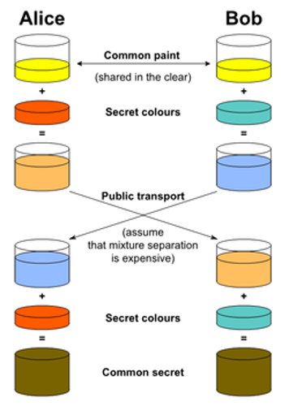
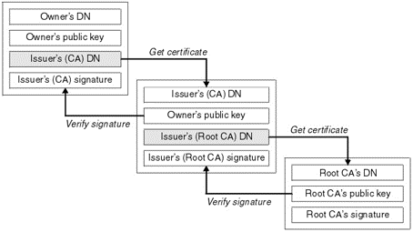
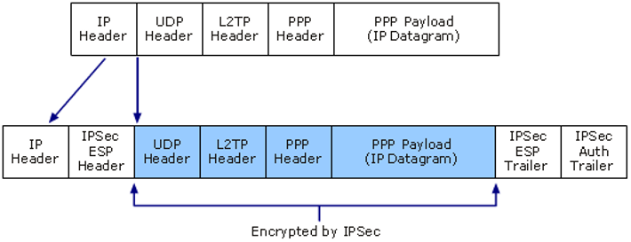
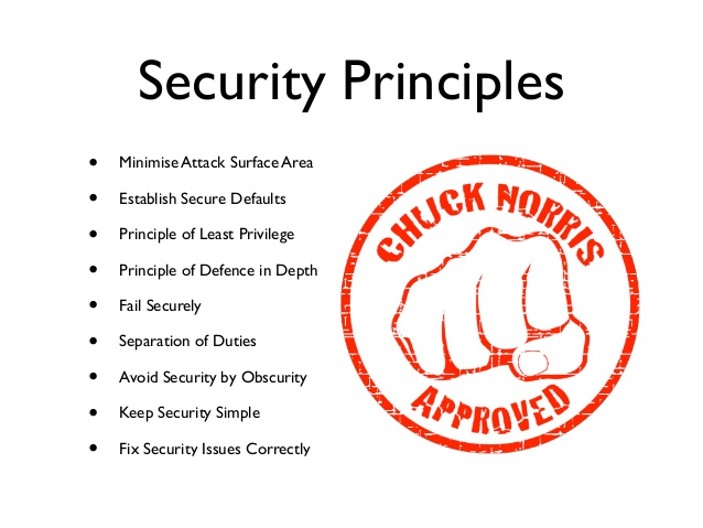

# Products

Products: de combinaties van policies en primitives die direct toepasbaar zijn in de praktijk.

> “The only truly secure system is one that is powered off, cast in a block of concrete and sealed in a lead-lined room with armed guards.”
>
> — Gene Spafford

Producten zijn de technische middelen die cryptografische primitieven bruikbaar maken binnen de door het beleid bepaalde processen. In deze quote zien we de primitieven “beton”, “lood” en “bewapening” gecombineerd worden met het beleid “uitgeschakeld”, “omheen gegoten” en “geinstrueerd personeel” om een ultiem veilig systeem te beschrijven.

## Welke van de volgende zijn producten?

- Virusscanner: Ja, combinatie van primitive “heuristische scan” en beleid “malwarebescherming”.
- ISO-cert: Nee. Is beleid
- DES: Nee, is een primitive
- RSA: Nee, is een primitive
- D(omein)V(alidatie)-certificaat: Ja, combinatie van primitive “encryptie” en beleid “identiteitsbeheer”
- Sterk wachtwoord: Ja, combinatie van primitive “hashing” en beleid “toegangsbeheer”

### Voorbeeld: TLS

- **T**ransport **L**ayer **S**ecurity (TCP);
- Gebruikt asymmetrische encryptie om servers te identificeren en sleutels uit te wisselen;
- Uitgewisselde sleutels worden gebruikt voor symmetrisch versleutelde communicatie gedurende sessie;
- Heette tot 1999 Secure Sockets Layer/SSL.

TLS is een mooi handvat voor deze les, omdat we heel veel van de onderwerpen van de voorgaande weken in TLS zien terugkeren

## Certificaten

- Universele manier om asymmetrische encryptie in te regelen (herinneren jullie je PKCS nog?);
- Bestaat in twee vormen: Web-of-Trust en Public Key Infrastructure;
  - **WOT**: Als je iemand kent vertrouw je zijn/haar certificaat;
  - **PKI**: Er zijn autoriteiten die certificaten uit mogen geven (“CA’s”) en hun “trust” betekent jouw “trust”;
- Bekende Certificate Authorities: GeoTrust, Comodo, Staat der Nederlanden, Let’s Encrypt.

PKCS: Use-cases voor certificaten/keypairs. Public Key Cryptography Standards

## Public Key Infrastructure

- Gebruiker genereert keypair en voegt identificerende data toe aan publieke deel;
- Private key blijft op computer, public key wordt naar CA gestuurd als “Certificate Signing Request”;
- CA encrypt de CSR met zijn private key en stuurt deze terug – nu is het een certificaat geworden;
- Gebruiker plaatst encrypted certificaat op zijn website;
- Bezoeker van website download het certificaat en decrypt het met de zich op het OS bevindende public key van de CA.

Zo is bewezen dat de CA zich garant stelt voor de identiteit van de website en de beheerder.
Dit is een geidealiseerde omstandigheid waarbij de afnemer direct met de CA communiceert. Dit gebeurt in de werkelijke wereld (bijna) nooit. Daarover straks meer

## Een certificaat maken op Linux

1. In de terminal:
   `openssl req -new -newkey rsa:4092 -nodes -keyout private.key - out public.csr`
2. Vul de gevraagde informatie in:
   - CN: Naam van het certificaat, bijv. het URL;
   - ON: Organisatienaam, bijv. Hogeschool Leiden
   - OU: Organistatieeenheid, bijv. Forensische ICT
   - Place: Stad, bijv Leiden;
   - State or Province: Provincie, bijv ZH
   - Country: Landcode, bijv. NL

`Openssl req (maak CSR) –new (nieuwe CSR) –newkey (genereer nieuwe sleutel) rsa:4092 (genereer een RSA sleutel van 4092 bits) –nodes (encrypt de uitgaande code niet) –keyout (voer de private key uit naar file) private.key (filename) –out (output-bestand) public.csr (filename van CSR)`

3. Kopieer private.key naar een veilige plaats;

4. Laat de CSR door een erkende CA encrypted (“signen”);

5. Plaat het getekende certificaat op de daartoe geeigende plaats (bijv /etc/httpd.conf/ssl);

6. Herstart je webserver en controleer of TLS naar behoren werkt!

---

## Assymetrische encryptie

### Problemen met asymmetrische encryptie

- Genereren van sleutels is duur (in CPU-tijd);
- Encrypten is duur;
- Decrypten is duur;
- Hergebruik van certificaten is gevaarlijk (key-reuse = no-no, remember?).

**Oplossing**: we gebruiken asymmetrische encryptie om een symmetrische sleutel af te spreken!
Asym naar sym. Maar da’s lastig, want we willen dat deze sleutel absoluut nooit ongeencrypt over de lijn gaat, Nog beter zou zijn als ie helemaal niet over de lijn gaat natuurlijk…..

---

## Key-generation in TLS sessies

2 mogelijkheden:

- **Makkelijk**: de client genereert een random nummer, crypt dit met de public key van de server en verstuurt het, of:
- **Moeilijk** (maar veilig): Diffie-Hellman Key Exchange

De eerste is makkelijk maar heeft wat problemen. Als de server’s connectie onderschept wordt of als de client slechte randomness genereert (herrinneren jullie je die les nog!) is dat een probleem. Daarom preferen we Diffie Hellmann

---

## Diffie-Hellman Key Exchange

- Bedacht in 1977;
- Opereert (net als RSA) op de aanname dat ontbinden in factoren van grote getallen lastig is;

  
Het plaatje legt conceptueel uit hoe DFH werkt. Beiden voeren een aparte berekening uit die op hetzelfde antwoord uitkomt. Dit antwoord wordt vervolgens gebruikt als sleutel voor de symmetrische encryptie

## Diffie-Hellman – de wiskunde

- Alice en Bob spreken een modulus ‘n’ en een basisgetal ‘g’ af. Het basisgetal moet een primitieve wortel zijn in die modulus!
- Alice kiest een geheim getal ‘a’ en verstuurt Bob “g^a mod n = A”;
- Bob kiest een geheim getal ‘b’ en verstuurt Alice “g^b mod n = B”;
- Alice berekent “B^a mod n = S”;
- Bob berekent “A^b mod n = S”.

Beiden komen op S uit, zonder dat dit getal ooit over de lijn is gegaan.

## Diffie-Hellman – een voorbeeld

- Laat modulus ‘n’ = 23 en laat basisgetal ‘g’= 5
- Alice kiest a = 4 en verstuurt A:
  - g (5)^a (4) mod n (23)= A (4);
- Bob kiest b = 3 en verstuurt B:
  - g (5)^b (3) mod n (23) = B (10);
- Alice berekent S volgens:
  - B (10)^a (4) mod n (23) = S (18)”;
- Bob berekent S volgens:
  - A (4)^b (3) mod n (23) = S (18)”.

Zie je? Beiden komen uit op S=18, zonder dat dit getal ooit verstuurd is.

## En wat spreken we dan af via Diffie-Hellman?

Symmetrische encryptiesleutel! Sneller, uniek per sessie, bit-voor-bit veiliger dan asymmetrische encryptie.

Door TLS 1.2 ondersteunde algoritmen:

- AES (block)
- Seed (block)
- 3DES (block) \*
- Camelia (block)
- ARIA (block)
  - GOST (block)\*
    - ChaCha (stream)
    - RC4 (stream)\*

\*3DES, GOST en RC4 zijn deprecated. Niet meer gebruiken! (gaan eruit bij TLS 1.3)

## Digitale handtekeningen

- Bestand versleutelen met private key;
- Door bestand te ontsleutelen met known-good public key is afkomst duidelijk;
- “Moet ik dan 7 miljard public keys opslaan op mijn pc?”.

Natuurlijk niet!
Het probleem met dit systeem is dat je dus van iedere private key op aarde de public zou moeten hebben om ze te vertrouwen. Dat laten we dus aan een tussenpersoon over: de CA

---

## PKI en Digitale Handtekeningen

- CA ontvangt CSR;
- CSR wordt certificaat;
- Bestand wordt met private key gecrypt;
- Bestand + certificaat worden verzonden;
- Ontvanger decrypt certificaat met public key CA;
  Hiermee is de authenticiteit van het certificaat bevestigd (“verification”);
- Ontvanger decrypt bestand met het nu ge-decrypte en gevalideerde certificaat.

Als je een certificaat besteld voor je webserver wordt dit gecrypt door de CA’s hoofd- of “root”-certificaat. De public keys behorende bij de cert staan dan ook in de trustlist van je device/OS/browser.

### “Jeumig, kan dat nóg complexer?”

- Een partij als VeriSign of GeoTrust handelt zelf geen klantaanvragen af. Daar zitten dus nog partijen tussen, de Registration Authorities;
- Sommige RA’s krijgen het recht om op basis van CA-certificaten zélf certificaten af te geven. Dit noemen we “Relegate CA’s”;
- Door dit stelsel van CA’s, RCA’s en RA’s kunnen soms lange kettingen van ondertekende certificaten ontstaan: certificate chains.

  
Registration Authorities zijn verantwoordelijk voor het controleren van de aanvragen, zodat de CA kan garanderen dat de houder van een cert is wie hij zegt dat hij is. Dit heet “vetting”

## Het intrekken van certificaten

- Centraal management betekent ook centraal weer intrekken;
- Vroeger: Certificate Revocation List (gewoon een tekstfile);
- Nu: OCSP (leuke afko voor mensen die OSCP willen gaan doen;
- Enorm belangrijk: zie de Diginotar-affaire.

Alle door een hacker gemaakt Diginotar certificaten moesten ASAP worden ingetrokken. Dat is gedaan door ze op een CRL (Certificate Revocation List) of OCSP (Online Certificate Status Protocol) te plaatsen. Dan wordt de checksum van het cert samen met een einddatum publiek gemaakt en zal iedere bezoekende client van de CA horen “dat certificaat is niet meer geldig!”

---

## Verdere toepassingen van crypto: VPN

- Virtual Private Network;
- Het encrypten van netwerkframes (ethernet bijv.) en deze verpakken in een IP-pakket;
- De ontvangende partij decrypt de frames en stuurt ze naar hun eindbestemming;
- Kan gebruikt worden voor veiligheid of om een netwerk te virtualiseren of het internet (“Tunnelen”);
- Niet te onderscheppen, vaak ook niet door firewalls en virusscanners.

### VPN-typen:

- Point-to-point: pure encapsulation tussen twee computersystemen;
- Point-to-site: manier om een op het internet aangesloten systeem virtueel in een LAN te hangen;
- Site-to-Site: manier om twee geografisch en fysiek van elkaar gescheiden netwerken als één samen te laten werken.

Kan werken in de fysieke laag (laag 1), linklaag (laag 2) of in de internetlaag (laag 3) van het IP-model.

### VPN-protocollen:

- OpenVPN: Gebruikt TLS, opereert in de internetlaag, werkt point-to-point, point-to-site en site-to-site (\*);
- IPSec: Opereert in de linklaag, site-to-site;
- PPTP: Opereert in de linklaag, point-to-point;
- VLAN: Opereert in de fysieke laag, site-to-site;

\* Door een flinke hoeveelheid truuks

### Packet encapsulation: de basis van VPN

Ipsec voegt een header/trailer toe (adressering etc) en crypt de inhoud van het pakket.

### VPN Authenticatie

- Mensen, computers aan beide zijden, misschien zelfs tussenliggende nodes;
- Niet triviaal, dus vaak obv. PKI/certificaten
- Al zit er meestal tóch nog wel ergens een wachtwoordje verscholen.

---

## Software

- Veel primitives en policies worden tegenwoordig ingebracht respectievelijk afgedwongen in software;
- Met name de “Secure Coding Principles” zijn hierin van belang;
- Het leeuwendeel van de zwakheden in computersystemen zijn te herleiden op een vrij kleine set aan fouten!

## Secure Coding Principles

### Minimaliseren van aanvalsvlakken

- Hoe minder “poorten naar buiten”, hoe veiliger;
- Want, meer ingangen = ook meer beveiliging;
- En natuurlijk een grotere kans op fouten;
- Denk aan applicatieinterfaces, user interfaces, socket-verbindingen, etc etc etc.

### Veilige standaarden

- Zonder verdere configuratie zo veilig mogelijk;
- Dus niet de windows methode: “alles mag tenzij het is dichtgezet”!

Deze normen zijn specifiek voor één bepaalde doelgroep opgesteld. De logo's onderop betreffen NEN-7510 “Informatiebeveiliging in de zorg”, het Thuiswinkel waarborg en PCI-DSS voor het afhandelen van creditcard betalingen.

### Verdediging in diepte

- Één is geen, wanneer het beveiliging betreft;
- Bouw een gelaagd systeem met authorisatie- en authenticatieslagen tussen deze lagen in;
- Een onion-ring dus, waarbij getrapte niveaus van beveiligingsnoodzaak aangehouden worden voor data-veiligheid.

### Veilig falen

- “Faeces occurs”, dat is een feit!
- Wanneer er iets kapot gaat moet dit op een nette, “graceful” en bovenal VEILIGE manier gebeuren;
- De veiligheidsmaatregelen moeten altijd actief blijven wanneer data-toegang dit ook is;
- Voorbeelden? Garbage collection, foutmeldingen die informatie verspillen, authenticatie die door een fout afbreekt maar de sessie toestaat, etc.

### Scheiding van verantwoordelijkheden

- In een bedrijf moeten rollen en verantwoordelijkheden gescheiden zijn. Dat is bij software niet anders;
- Beheerders mogen meer dan gebruikers;
- Hou accountability in het oog!
- Dit proces wordt ook wel “Autorisation Management” genoemd.

### Security by obscurity vermijden

- SbO = een systeem beveiligen door het moeilijker te begrijpen te maken: “Ach joh, niemand weet toch dat ik “1234” hardcoded als admin password heb ingesteld?”
- SbO != security! SbO gaat ervan uit dat de ontwikkelaar slimmer is dan alle andere mensen op aarde – bij elkaar. Spoiler alert: dit is niet het geval;
- SbO is zéér kwetsbaar voor laterale aanvallen (=onverwachte hoek of onverwacht inzicht) en niet in-depth.

### Security simpel houden

- Hoe complexer het beveiligingsontwerp, hoe groter de kans op fouten;
- Hoe complexer het beveiligingsontwerp, hoe moeilijk om te maken;
- Hoe complexer het beveiligingsontwerp, hoe groter de kans dat mensen er omheen willen gaan werken.

### Los issues op een juiste manier op

- Wederom: “faeces occurs”. Fouten worden gemaakt en dienen op een nette, constructieve manier opgelost te worden;
- Conform de PDCA-cyclus uit de vorige les: alles moet BETER worden!
- Hou je dus, wanneer je een probleem verhelpt, aan de voornoemde principes!

We weten nu meer over de manier waarop Policies en Primitives samengebracht worden. Volgende week gaan we kijken naar Informatiebeveiliging in de praktijk, aan de hand van een flink aantal voorbeelden…
